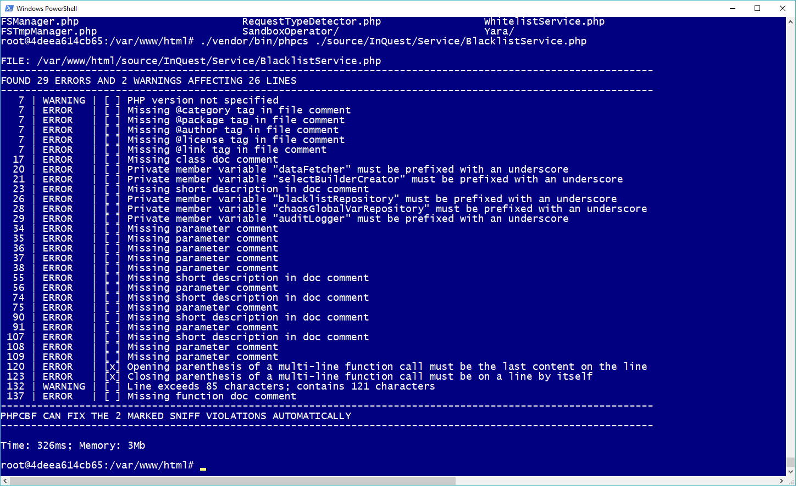
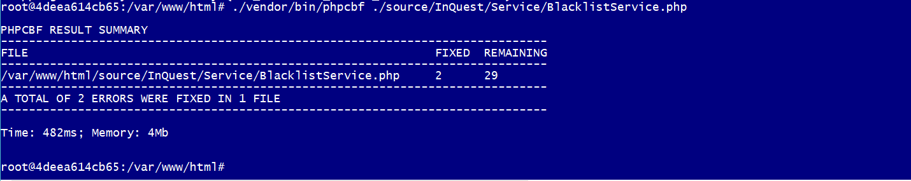
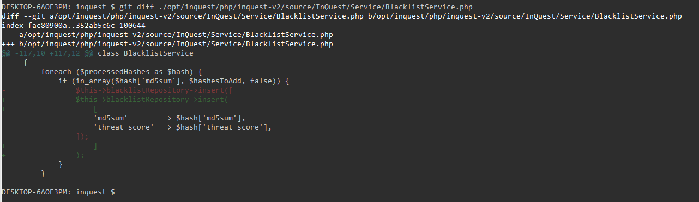
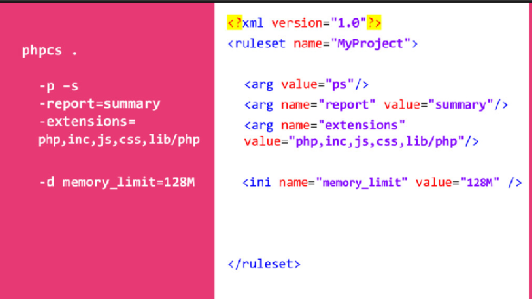
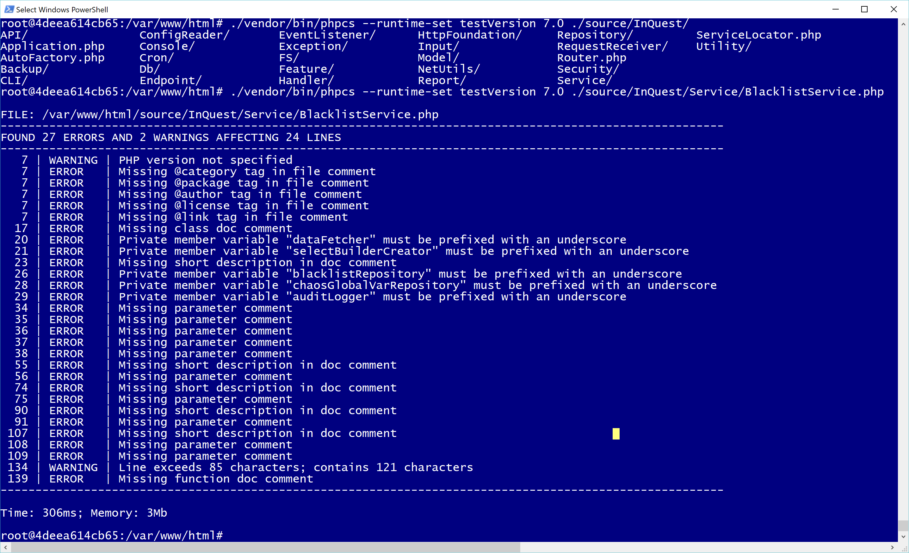
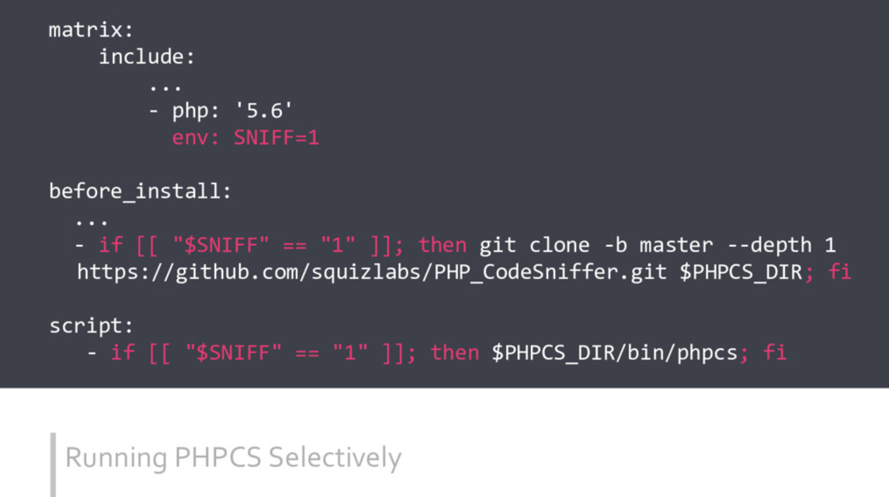

title: Emily Stamey
author:
    name: Emily Stamey
    twitter: elstamey
    url: http://elstamey.com
output: codesniffer.html
theme: elstamey/reveal-cleaver-theme
style: my-style.css
-------------------

### Codesniffer
#### https://github.com/squizlabs/PHP_CodeSniffer

- detects violations of a defined set of coding standards
- PHP, JavaScript and CSS files 

-- 

### Installing via composer

    $ composer require --dev squizlabs/php_codesniffer

--

### Scan a single file

    $ phpcs /path/to/myfile.php

--

### Scan a directory or project

    $ phpcs /path/to/project/

--

### REPORT

    $ phpcs --report=summary /path/to/code

    PHP CODE SNIFFER REPORT SUMMARY 
    --------------------------------------------------------------------------------
    FILE                                                            ERRORS  WARNINGS 
    -------------------------------------------------------------------------------- 
    /path/to/code/myfile.inc                                        5       0 
    /path/to/code/yourfile.inc                                      1       1 
    /path/to/code/ourfile.inc                                       0       2 
    -------------------------------------------------------------------------------- 
    A TOTAL OF 6 ERROR(S) AND 3 WARNING(S) WERE FOUND IN 3 FILE(S) 
    --------------------------------------------------------------------------------

--

### Installed Standards

    $ phpcs -i
    The installed coding standards are MySource, PEAR, PHPCS, PSR1, PSR2, Squiz and Zend

--

### View the report in Docker
  

    $ ./vendor/bin/phpcs --report=summary  ./source/
  
--

### Run against a single file

  
--

### Fix the 2 Marked errors

  
--

### Inspect Changes with git diff

--

### Test for a specific Sniff

    $ phpcs --standard=PEAR --sniffs=Generic.PHP.LowerCaseConstant,PEAR.WhiteSpace.ScopeIndent /path/to/code

--

### Exclude specific sniffs

    $ phpcs --standard=PEAR --exclude=Generic.PHP.LowerCaseConstant,PEAR.WhiteSpace.ScopeIndent /path/to/code

--

### Search by severity

    $ phpcs --severity=3 /path/to/code

--

### Tabs to spaces

    $ phpcs --tab-width=4 /path/to/code

--

### Specify php.ini settings

    $ phpcs -d memory_limit=32M /path/to/code

--

### PHPCS looks for a default config file

Default config file is called 'phpcs.xml'

--

### Commandline vs Config file

- source of image: ["Making PHP CS Work For You"](https://speakerdeck.com/jrf/dont-work-for-phpcs-make-phpcs-work-for-you-1) by [@jrf_nl](http://twitter.com/jrf_nl)

--

### Sample Config

[phpcs.xml.dist](https://raw.githubusercontent.com/squizlabs/PHP_CodeSniffer/master/phpcs.xml.dist)

--

### More Example Config Files

[Example 'phpcs.xml' from "Make PHP CS Work for You"](https://github.com/jrfnl/make-phpcs-work-for-you) by [@jrf_nl](http://twitter.com/jrf_nl)

--

### Sniffs and Customizable Properties

[properties](https://github.com/squizlabs/PHP_CodeSniffer/wiki/Customisable-Sniff-Properties)
[PSR2 sniffs](https://github.com/squizlabs/PHP_CodeSniffer/wiki/Customisable-Sniff-Properties#psr2-sniffs)

--

### PHPCBF can fix it for you

You can view proposed changes before you do it

    $ phpcs --report=diff /path/to/code

--

### PHP Compatibility

--

### a few simple rules

* always pass it a 'testVersion' to get the best results
* pass minor version numbers, not patch
* can pass a range of versions '5.6-7.2'
* '5.6-' means 5.6 and any PHP versions from thereon up, i.e. '5.6-99.0'

--

### DIY Sniffs

[How To](https://github.com/squizlabs/PHP_CodeSniffer/wiki/Coding-Standard-Tutorial)

[Contribute your Sniffs on github](https://github.com/squizlabs/PHP_CodeSniffer/blob/master/CONTRIBUTING.md)

--

### Contribute to PHP Compatibility

[PHP Compatibility github](https://github.com/wimg/PHPCompatibility/)

--

### Continuous Integration

--

[Examples of PHPCS and Travis](https://github.com/jrfnl/make-phpcs-work-for-you/tree/master/travis-examples)

- source of previous image and this repo: ["Making PHP CS Work For You"](https://speakerdeck.com/jrf/dont-work-for-phpcs-make-phpcs-work-for-you-1) by [@jrf_nl](http://twitter.com/jrf_nl)

