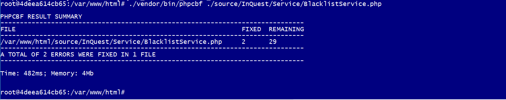
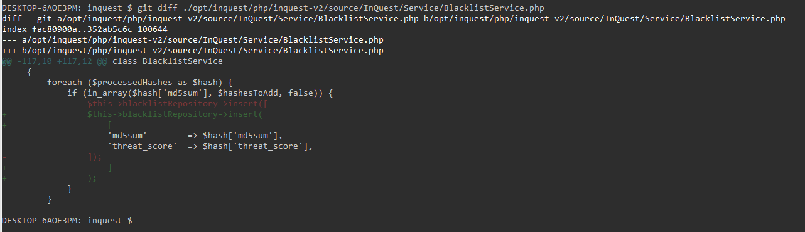

title: Emily Stamey
author:
    name: Emily Stamey
    twitter: elstamey
    url: http://elstamey.com
output: codesniffer.html
theme: elstamey/reveal-cleaver-theme
style: my-style.css
-------------------

# Codesniffer
## https://github.com/squizlabs/PHP_CodeSniffer

- detects violations of a defined set of coding standards
- PHP, JavaScript and CSS files 

-- 

# Scan a single file

    $ phpcs /path/to/myfile.php

--

# Scan a directory or project

    $ phpcs /path/to/project/

--

    $ phpcs --report=summary /path/to/code  
    PHP CODE SNIFFER REPORT SUMMARY 
    --------------------------------------------------------------------------------
    FILE                                                            ERRORS  WARNINGS 
    -------------------------------------------------------------------------------- 
    /path/to/code/myfile.inc                                        5       0 
    /path/to/code/yourfile.inc                                      1       1 
    /path/to/code/ourfile.inc                                       0       2 
    -------------------------------------------------------------------------------- 
    A TOTAL OF 6 ERROR(S) AND 3 WARNING(S) WERE FOUND IN 3 FILE(S) 
    --------------------------------------------------------------------------------

--

    $ phpcs -i
    The installed coding standards are MySource, PEAR, PHPCS, PSR1, PSR2, Squiz and Zend

--

  # View the report in Docker
  
  $ ./vendor/bin/phpcs --report=summary  ./source/
  
--

  
--

  
--

