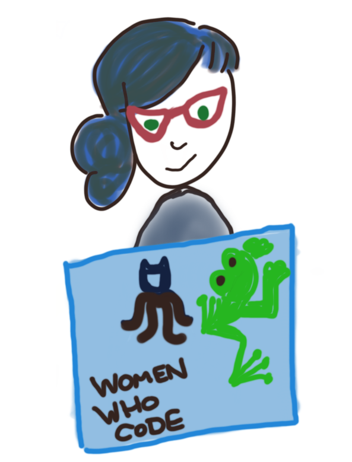
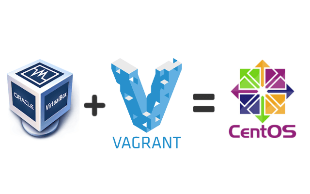
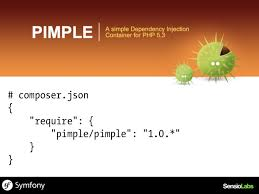
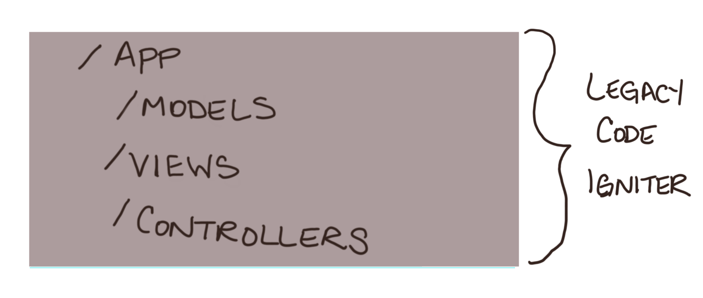
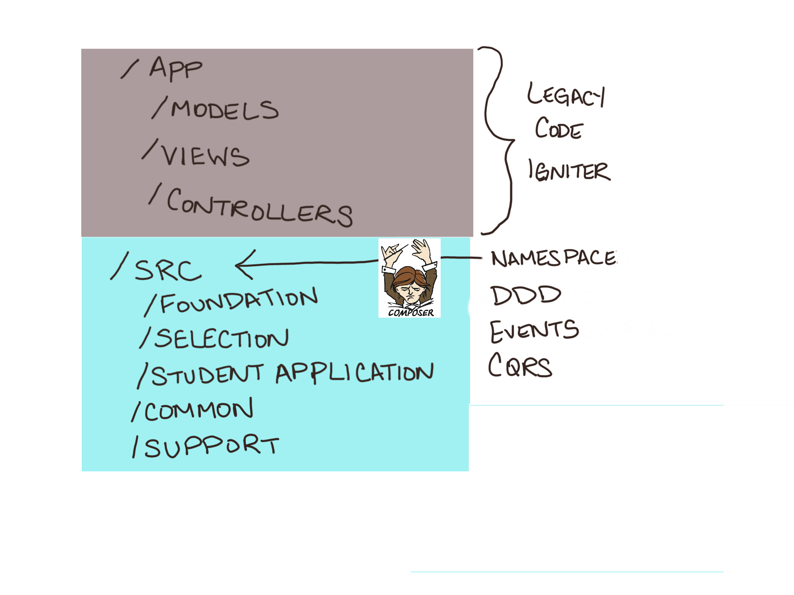
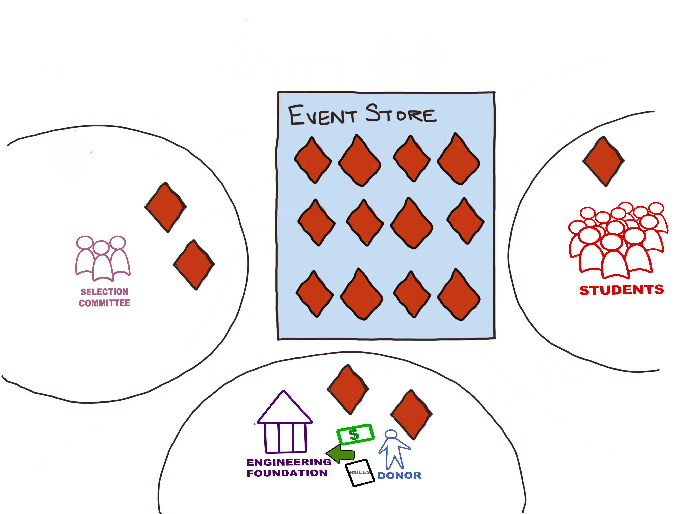
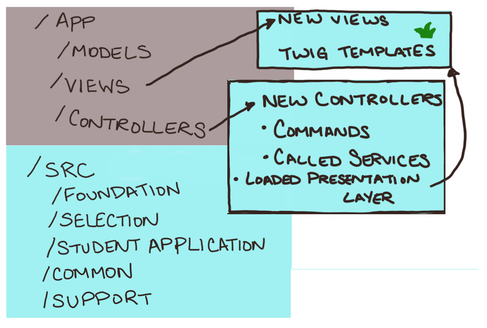
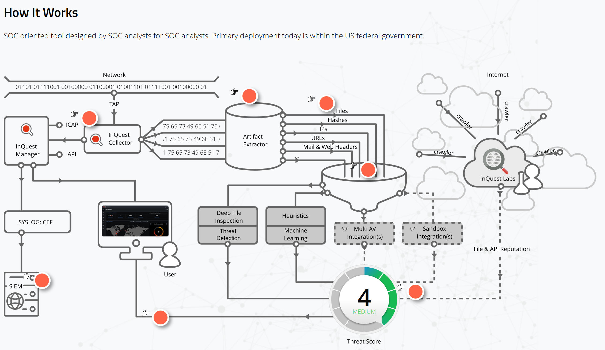

title: Hey Boss, Event Sourcing Can Fix That!
author:
  name: Emily Stamey
  twitter: elstamey
  url: http://elstamey.com
theme: elstamey/reveal-cleaver-theme
style: basic-style.css
output: hey_boss.html
controls: true

--

# Event Sourcing Can Fix That!

--

--

--

# Basics of Event Sourcing

- pull from library 11-45 with thinning

--

# Scholarships 

- replaced in pieces
- added DDD & ES & CQRS beside complex framework spaghetti
- separation of concerns
- cleaner history and reports of what had been done

--

--

--

--

--

--

--

--

--

## Dependency Injection

- add slide from bootstrapping through controllers and rearrange

--

## Legacy

- this was an example of replacing the code in pieces
- could have replaced only one part or a few
- really powerful to see which parts of your application could benefit from event sourcing
- and finding the simplest way to implement

--

# Student Enrollment Process

- rewrote
- ES to follow the process
- status drop-down versus events

--

--

# Diagram

--

# Session Threats Report

- multiple daemons running parts of code and the UI consumes the results of the analysis
  - complex DB queries
  - reports are slow to generate on-demand

--

## Event: SessionDiscovered

- after validation to determine whether we have a valid session, we log a new event

--

### new SessionDiscovered( attributes we need to know )

--

## Event: SessionDiscovered

- session id
- start time
- protocol
- source ip
- destination ip
- source port
- destination port 

--

## Event: SessionScored

- session id
- threat contributor
- score

--

## Event: FileScored

- after validation that a file has matched a signature, we log a new event

### new FileScored( attributes we need to know )

--

## Event: FileScored

- file id
- session id
- integration
- score
- signature that found it

--

## Event: FileRescored

- after validation that a file has matched a signature and that it has been scored before\n- we log a new event

### new FileRescored( attributes we need to know )

--

## Event: FileRescored

- file id
- session id
- integration
- new score
- signature that found it 

--

## Projection: Session

- listens for SessionDiscovered events
  - creates a new row in a table with the session details and a null score
- listens for SessionScored events
  - finds the session in the table and updates the score and score contributor

-- 

## Projection: Report for Top Threats by Hash

- listens for FileScored and FileRescored Events
  - looks up details of file by the file id
  - adds a row to table with 
    - file id
    - file md5 hash
    - the filename
    - file type
    - the score
    - signature that scored it
    - source ip
    - destination ip
    - protocol

--

## Read Model: Top Threats

methods: 

- top 10 threats by the file hash
  - this excludes hits I'm not allowed to see by the signature that did the scoring
  - gets a current hit count of only the records I can see

- top threats by file type
- top threats by source/destination ip pairs
- top threats by protocol

--

## Good Stuff!

- works well in our environment where we have multiple applications doing different things
- full audit log of what has happened in our environment
- the results of those events can be optimized for read to shorten the time to retrieve data
- separate the logic of what an event means based on context and purpose
- only display results that a user is allowed to see
- flexible to change, our interpretation of events can change, and we can rebuild projections without losing the full history

--

## Signatures

- history of changes
- past scores/score history

--

## Rescans and history from rescans

- what can we see?

--

## Efficiency

- With events written, can process them for multiple contexts
- Speed up scans by delaying the writes to the report
- Speed up reports by building from events/optimized for read

--

# Thank you

