title: Event Sourcing a Small Library
author:
  name: Emily Stamey
  twitter: elstamey
  github: 
  url: https://www.elstamey.com/
  email: 
theme: elstamey/reveal-cleaver-theme
style: css/my-style.css
output: library.html
controls: true

--

# Event Sourcing a Small Library

  Emily Stamey @elstamey

--

# Introduction: The Library

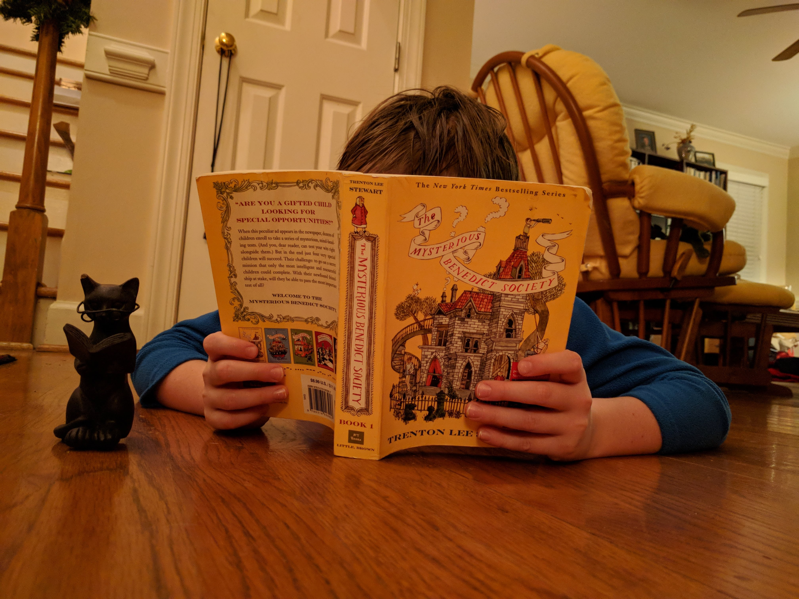

--

# Introduction: The PM

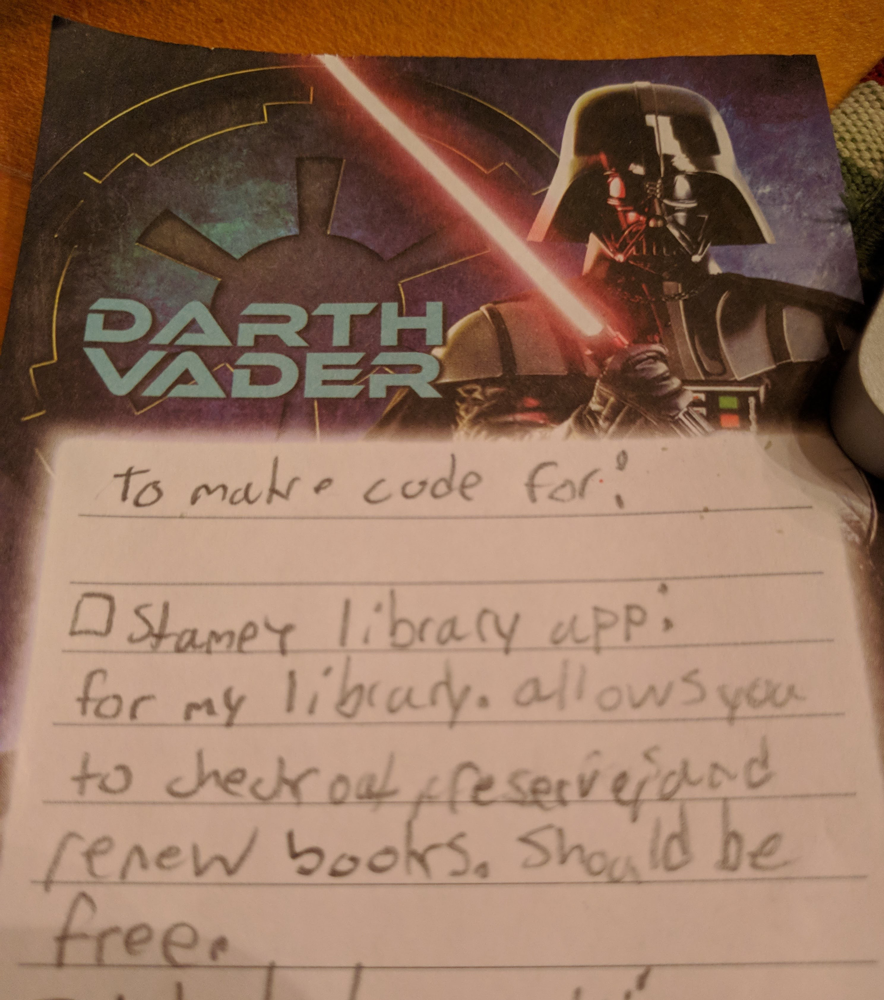

--

# Requirements

- Check out books
- Reserve books
- Renew books

--

# The Library Process

- Check in and Check out Books
- View a List of Books I Own
- See who has checked out books

--

# Crud

    <?php
    
    namespace Library\Http\Controllers\Api\V1;
    
    use Illuminate\Http\Request;
    use Library\Book;
    use Library\Http\Controllers\Controller;
    
    class BooksController extends Controller
    {
        public function index()
        {
            return Book::all();
        }
    
        public function show($id)
        {
            return Book::findOrFail($id);
        }
    
        public function update(Request $request, $id)
        {
            $Book = Book::findOrFail($id);
            $Book->update($request->all());
    
            return $Book;
        }
    
        public function store(Request $request)
        {
            $Book = Book::create($request->all());
            return $Book;
        }
    
        public function destroy($id)
        {
            $Book = Book::findOrFail($id);
            $Book->delete();
            return '';
        }
    }
    

--

# Checking Out and Checking In Books

- could easily be a custom variation of the update
- using a status table to show if the book is in or out
- and any of this would be fine

--

## This WILL seem like overkill for a little bit 

- changing habits is tough
- building your app around events is different than CRUD
- not all applications **need** to be event sourced

--

# We're going to talk about:
 
  - What is Event Sourcing
    - Rules to Follow
    - the data structures: Events, Projections, Read Models, CQRS
  - How our code will change to create Check In and Check Out Events
  - Why logging the check-in and check-out as events instead of statuses is more useful 
  - Flexibility gained long term
  - Adding Event Sourcing to Your Legacy App 

--

--

# Event Sourcing

The fundamental idea of Event Sourcing is that of ensuring <strong>every change to the state</strong> of an application <strong>is captured in an event object</strong>, and that these event objects are themselves stored in the sequence they were applied for the same lifetime as the application state itself.

  Martin Fowler
   
--

# Events and Listeners

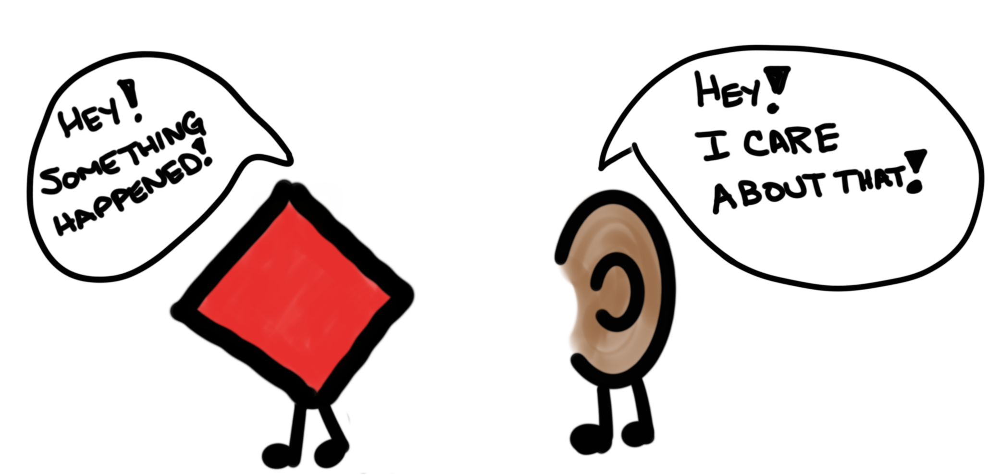

  
--

# An Event

- The thing that happened (ex. **BookWasCheckedOut**)
- Details of that event (book id, date, patron id)
- Order/Sequence they occurred

--

# Event Attributes

- book id
- date
- patron id

We are deciding between what we need to preserve and what we can look up later:
  - all patron info?

--

# Why Events?

- State transition are important
- We need an audit log, proof of the state we are currently in
- The history of what happened is more important than the current state
- Events are replayable if behavior in your application changes

--

# Rules to Follow

- Usually named as past-tense verbs
- **RARELY** changed
- **Never** deleted
- Has attributes that are values
  - not model, object, collection, or aggregate root

--

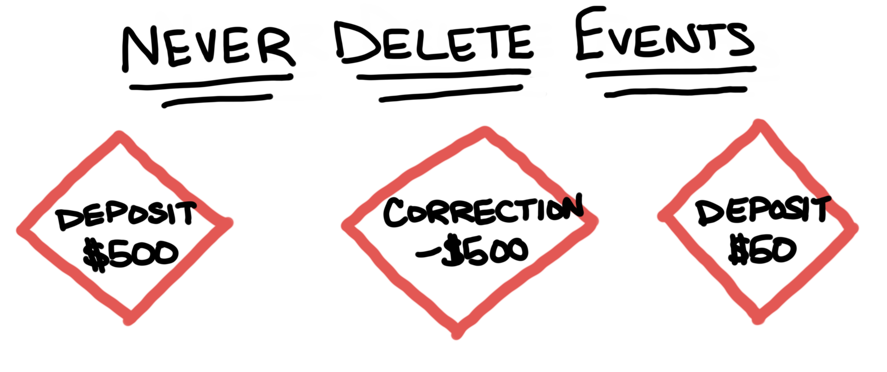

--  

# Don't store objects

--

# If We Stored it in an Event...

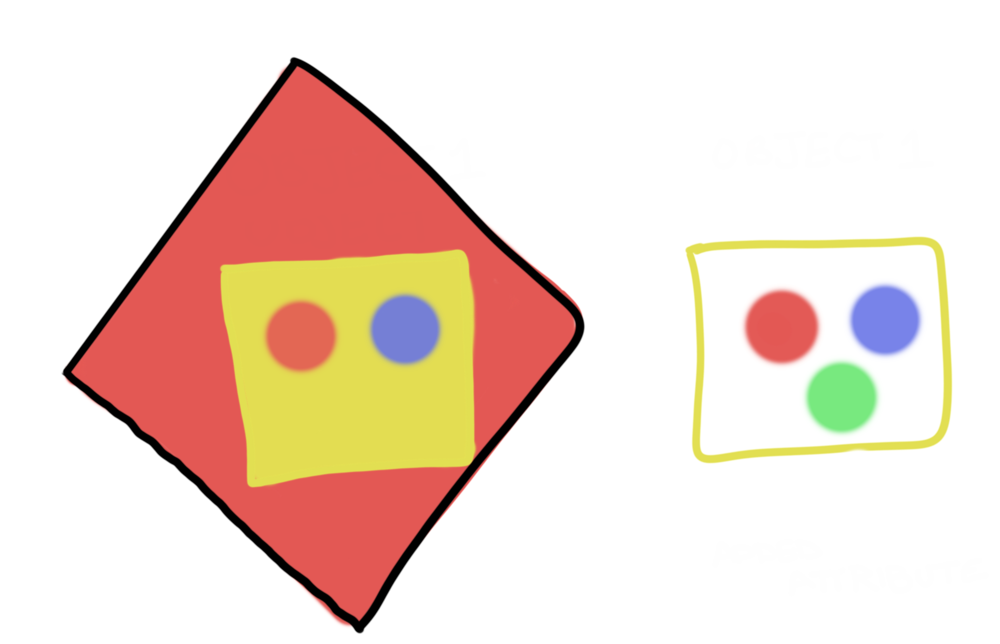

--

# Events are not Bionic

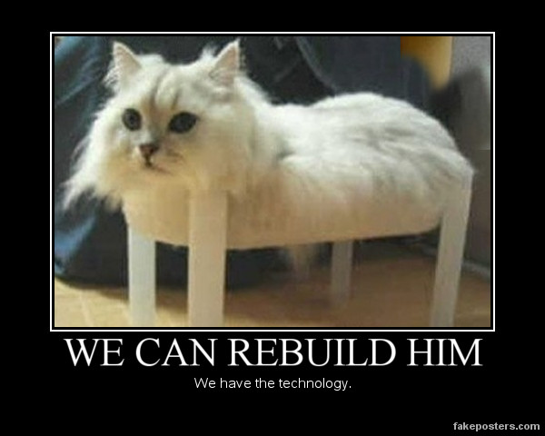

--

## Events rarely change

- The part of the code that will change is most likely the **result that follows that event**.
- The **structure of the resulting data** is more likely to change than the thing that happened

--

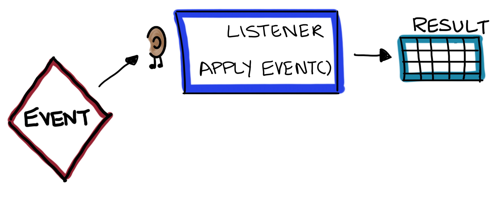

--

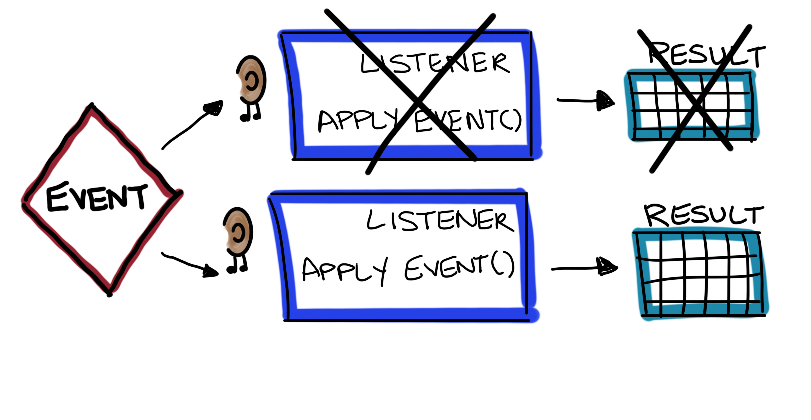

--

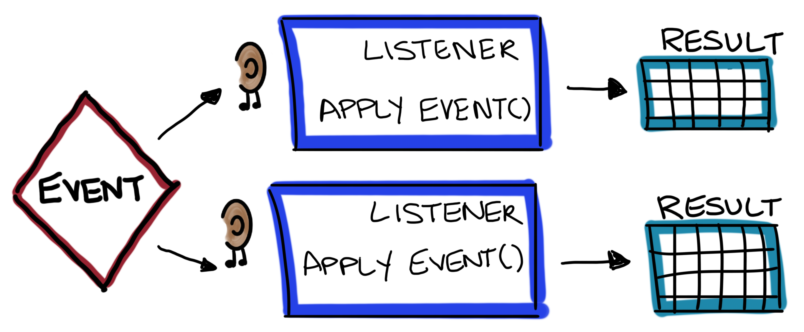

--

# Event Class

    &lt;?php
    
    namespace Library\Events;
    
    use Library\Support\Event;
    
    class BookWasCheckedOut 
    {
    
        /**
         * @var DateTime 
         */
        public $checkoutDate;
    
        /**
         * @var int
         */
        public $patronId;
    
        /**
         * @var int
         */
        public $bookId;
    
        public function __construct(DateTime $checkoutDate, PatronId $patronId, BookId $bookId)
        {
    
            $this->checkoutDate = $checkoutDate;
            $this->patronId = $patronId;
            $this->bookId = $bookId;
        }
    
        /**
        * @return array
        */
        public function serialize()
        {
            return [
                'checkout_date' => $this->$checkoutDate->toString(),
                'patron_id' => $this->patronId->toNative(),
                'book_id' => $this->bookId->toNative(),
            ];
        }
    
        /**
        * @param array $data
        *
        * @return static
        */
        public static function deserialize($data)
        {
            return new BookWasCheckedOut(
                DateTime::createFromFormat('j-M-Y', $data['checkout_date']),
                PatronId::fromNative($data['patron_id']),
                BookId::fromNative($data['book_id'])
            );
        }
    }

--

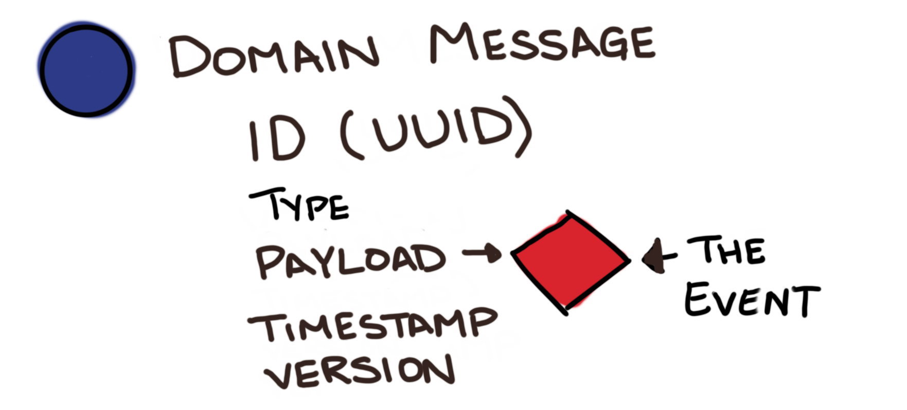

--

# Event Store

- Domain-specific database
- Based on a Publish-Subscribe message pattern

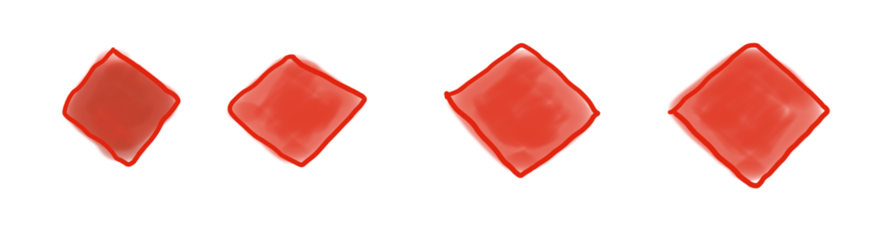

--

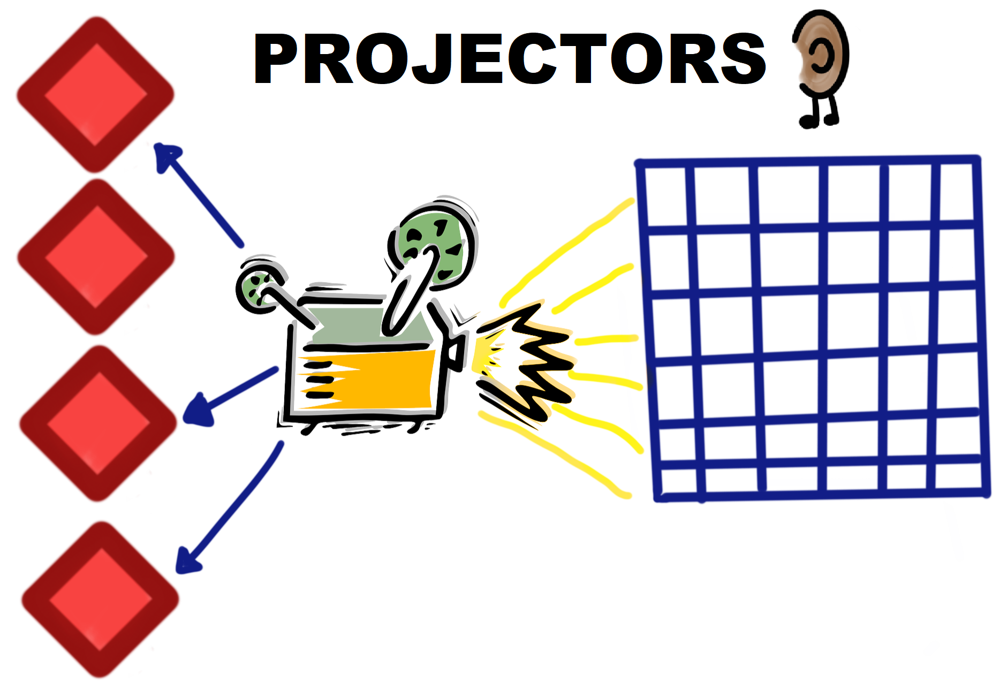

A set of event handlers that work together to build and maintain a read model.

--

# Projector

    &lt;?php
    
    namespace Library\ReadModel;
    
    
    use Library\Events\BookWasCheckedIn;
    use Library\Events\BookWasCheckedOut;
    use App\Support\ReadModel\Replayable;
    use App\Support\ReadModel\SimpleProjector;
    use Illuminate\Database\Schema\Blueprint;
    use Illuminate\Database\Connection;
    
    class BookshelfProjector extends SimpleProjector implements Replayable
    {
    
        /**
         * @var Connection
         */
        private $connection;
    
        /**
         * @var string table we're playing events into
         */
        private $table = 'proj_bookshelf';
    
        public function __construct(Connection $connection)
        {
            $this->connection = $connection;
        }
    
        public function beforeReplay()
        {
            $builder = $this->connection->getSchemaBuilder();
    
            $builder->dropIfExists('proj_bookshelf');
            $builder->create('proj_bookshelf_tmp', function (Blueprint $schema) {
                $schema->string('book_id');
                $schema->string('book_title');
                $schema->string('book_author');
                $schema->string('status');
                $schema->string('checkout_date');
                $schema->string('patron_id');
    
                $schema->primary('book_id');
            });
            
            $this->table = 'proj_bookshelf_tmp';
        }
    
        public function afterReplay()
        {
            $builder = $this->connection->getSchemaBuilder();
    
            $builder->dropIfExists('proj_bookshelf');
            $builder->rename('proj_bookshelf_tmp', 'proj_bookshelf');
    
            $this->table = 'proj_bookshelf';
        }
    
        /**
        * @param BookWasCheckedOut $event
        */
        public function applyBookWasCheckedOut(BookWasCheckedOut $event)
        {
            $bookshelfItem = BookshelfItem::where('id', $event->bookId);
            
            $book->status = 'Checked Out';
            $book->checkout_date = $event->checkoutDate;
            $book->patron_id = $event->patronId;
            
            $book->save();
        }
    
        /**
        * @param BookAddedToBookshelf $event
        */
        public function applyBookAddedToBookshelf(BookAddedToBookshelf $event)
        {
            $bookshelfItem = new BookshelfItem();
            $bookshelfItem->setTable($this->table);
    
            $bookshelfItem->bookId = $event->bookId;
            $bookshelfItem->bookTitle = $event->bookTitle;
            $bookshelfItem->bookAuthor = $event->bookAuthor;
            $bookshelfItem->status = 'on shelf';
    
            $bookshelfItem->save();
        }
    
    }

A set of event handlers that work together to build and maintain a read model.

--

# Read Model

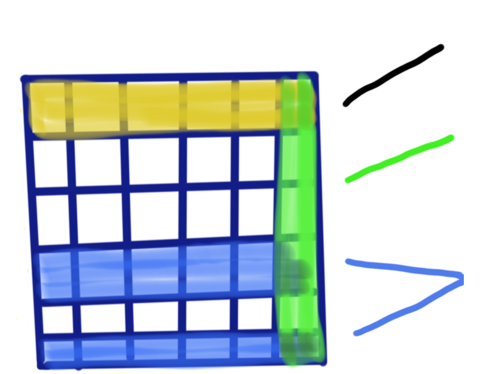

--

# Read Model

    
    &lt;?php
    
    namespace Library\ReadModel;
    
    
    use Carbon\Carbon;
    use Illuminate\Database\Eloquent\Model;
    
    /**
    * @codeCoverageIgnore
    */
    class Bookshelf extends Model
    {
        protected  $table = 'proj_bookshelf';
        public $incrementing = false;
        public $timestamps = false;
    
        public static function lookupLoansFor($patronId)
        {
            return static::where('patron_id', $patronId)->get();
        }
    
        public function lookupAvailableBooks()
        {
            return static::where('status', 'on shelf')->get();        
        }
        
        public function lookupOverdueBooks()
        {
            return static::where('checkout_date', '<', date('Y-m-d', strtotime('-7 days')))->get();        
        }        
    }

--

# But how do the Events get there?

--

# Our Book

--

When we click the button, the router can send us to the controller action

--

# BooksController: update

    public function update(Request $request, $id)
    {
        // our default update method
        $Book = Book::findOrFail($id);
        $Book->update($request->all());

        return $Book;
    }

--

# CRUD to CQRS

    public function checkOutBook(Request $request, $id)
    {
        // altered the update method
        $Book = Book::findOrFail($id);
        $Book->update('status' => 'checked out',
                        'patron' => $request->patronId);

        return $Book;
    }

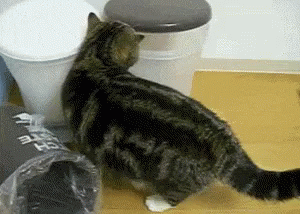
--

# CQRS

**Command and Query Response Segregation**

- When parts of your application no longer fit a CRUD model
- Should only be used on specific portions of a system, not the system as a whole
- Not a CRUD-based UI, but a Task-based UI

-- 

# CQRS

- **Command** is any method that mutates state
- **Query** is any method that returns a value
- These methods become part of Services

--

# Separate Read/Write

- all **commands** go into a WriteService
- all **queries** go into a ReadService
- to optimize your application for reads and writes
- Separate the load from reads and writes allowing you to scale each independently. 
  - *If your application sees a big disparity between reads and writes this is very handy.* 
- Uses a separate model for all queries

--

# Task-based UI

- track what the user is doing and push forward commands representing the intent of the user 
- CQRS **does not require** a task based UI (DDD does)
- CQRS used in a CRUD interface, makes creating separated data models harder 

--

# Library

- may not be a purely task-based UI
- I don't need to optimize for load

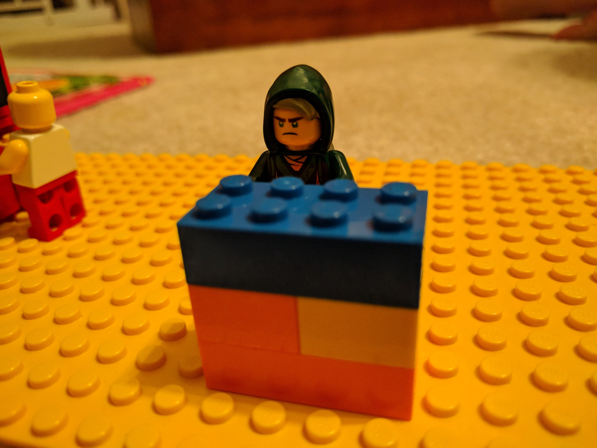

-- 

# Command Handler

A command handler receives a command and brokers a result from the appropriate aggregate. "A result" is either a successful application of the command, or an exception.

1. Validate the command on its own merits.
2. Validate the command on the current state of the aggregate.
3. If validation is successful, 0..n events (1 is common).
4. Attempt to persist the new events. If there's a concurrency conflict during this step, either give up, or retry things.

- should affect one and only one aggregate
- cannot call a read side
- 
--

# BookLendingService

- CheckOutBook
- CheckInBook
- RequestBook

--

# the data structures: Events, Projections, Read Models, CQRS

--

# How our code will change to create Check In and Check Out Events

--

# Why logging the check-in and check-out as events instead of statuses is more useful 

--

--

# Flexibility gained long term

- With our Scholarships Application, we helped a student match for the scholarship.  We kept track of the current budgets so different users of the system could see what money was left to be awarded
- If we needed to see the budgets on any given day in the past, we could produce that information
- And when they completely changed the format of budgets they wanted to review, we could easily rebuild that without affecting the amounts.

--

# Adding Event Sourcing to Your Legacy App 

--

--

# Something happened

In many applications, we tend to change a status to reflect that something already happened.  It's interpreted, but those statuses or interpretations can change over time, making our data inconsistent.

   
--

# Resources

- [CQRS by Martin Fowler](https://martinfowler.com/bliki/CQRS.html)
- [CQRS by Greg Young](http://codebetter.com/gregyoung/2010/02/16/cqrs-task-based-uis-event-sourcing-agh/)

--

# Test

