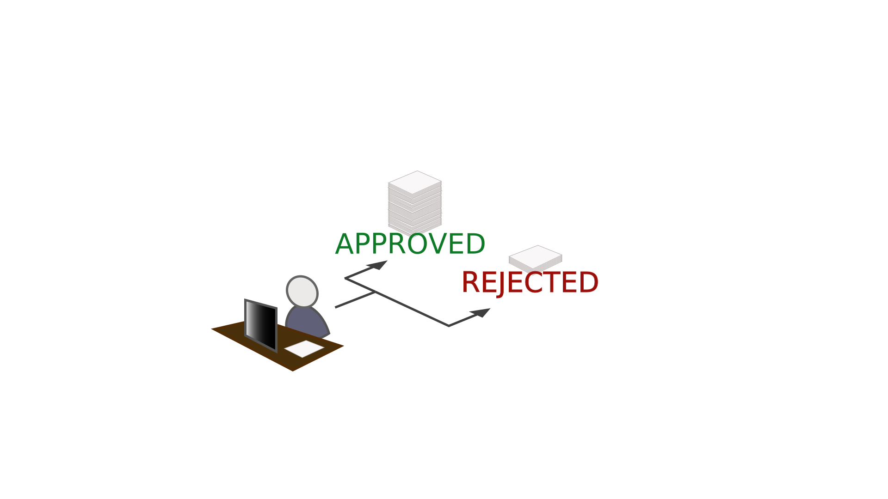
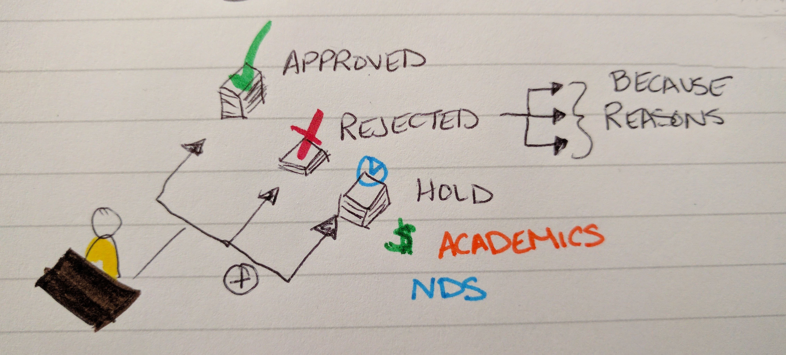
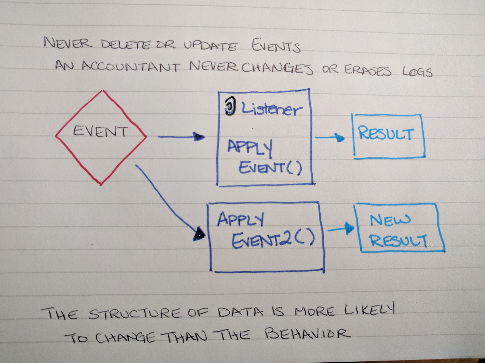

title: Status Change Now Using Event Sourcing
author:
  name: Emily Stamey
  twitter: elstamey
  url: http://elstamey.com
theme: elstamey/reveal-cleaver-theme
style: basic-style.css
output: index.html
controls: true

--

# Status Change: 
## Now Using Event Sourcing

--

## What we'll cover:

- Handling **process** in our apps then and now
- What is Event Sourcing?
- Why would we want to use it?  
- Introducing what this code looks like (I hope)

--

## Forms

A lot of our systems are built to facilitate or replace paper processes

They often closely map to this physical form.

--

<!--  -->

--

## Status

These piles were effectively our status of the form

In our web forms we began using a drop-down menu to change the status.

As the process matured, this increased complexity of status.

--

## Paper Forms handling state

--
 
## Paper Forms handling state

 
--

## But that stamp doesn't indicate why or communicate to the applicant what happened

--

## Why are they in their current state?

These states carry assumed knowledge of the process without clearly saying what happened.

Sometimes they are separated from the request's history.

Status meaning or names can change over time without conveying process changes

--

## Compensating with Web Forms
### Preserving some history
- add columns to the table with form data
- add a related table for notes
- more statuses to include the many forks in the process (like what type of hold)

--

--

 <!-- ## Example: Student Enrollment Request -->

 <!-- The admin reviews the Request and the student: -->
 <!-- - prerequisites -->
 <!-- - academic hold -->
 <!-- - financial hold -->
 <!-- - student type -->

 <!-- -- -->

 <!-- ## Example: Student Enrollment Request -->

 <!-- Admin responds to the request: -->
 <!-- - enroll -->
 <!-- - reject -->
 <!-- - hold -->
 <!-- - waitlist -->

 <!-- -- -->

 <!-- ## Example: Student Enrollment Request -->

 <!-- - prerequisites  -->
<!--
         <!-- => yes enroll -->
<!--          
         <!-- => no reject -->
<!-- - academic hold  -->
<!-- 
         <!-- => hold -->
 <!-- - financial hold -->
<!--  
         <!-- => hold -->
 <!-- - student type -->
<!--
         <!-- => waitlist -->
<!-- -->

 <!-- -- -->

 <!-- ## Example: Enrollment Request States -->

 <!-- - Approved -->
 <!-- - **Hold** -->
 <!-- - Waitlist -->
 <!-- - Rejected -->

--

## How workflows become complex

--

-- code

Sometimes your workflow forks in multiple directions or involves long 
lists to capture the complexity of the business process

<B>Change to Status:</B>
<select name="newStatus">
    <option value="RECEIVED">RECEIVED</option>
    <option value="CANCELLED">CANCELLED</option>
    <option value="COURSE CANCELLED">COURSE CANCELLED</option>
    <option value="COURSE NOT APPROVED">COURSE NOT APPROVED</option>
    <option value="CPC DENIED">CPC DENIED</option>
    <option value="CPC NOT APPROVED">CPC NOT APPROVED</option>
    <option value="CPC PENDING TRANSCRIPT">CPC PENDING TRANSCRIPT</option>
    <option value="CPC PROCESSING">CPC PROCESSING*</option>
    <option value="DENIED">DENIED</option>
    <option value="DROPPED AFTER CENSUS">DROPPED AFTER CENSUS*</option>
    <option value="DROPPED BEFORE CLASSES BEGUN">DROPPED BEFORE CLASSES BEGUN*</option>
    <option value="DROPPED BETWEEN BEGINNING OF CLASS AND CENSUS DATE">DROPPED BETWEEN BEGINNING OF CLASS AND CENSUS DATE*</option>
    <option value="DROPS/WITHDRAWALS AT SITES">DROPS/WITHDRAWALS AT SITES*</option>
    <option value="ECE ON CAMPUS STUDENTS">ECE ON CAMPUS STUDENTS</option>
    <option value="ENROLLMENT CANCELLED">ENROLLMENT CANCELLED</option>
    <option value="EOL APPROVED">EOL APPROVED*</option>
    <option value="EOL MISC">EOL MISC*</option>
    <option value="NEW STUDENT REGISTRATION">NEW STUDENT REGISTRATION</option>
    <option value="PENDING ON CAMPUS REQUEST">PENDING ON CAMPUS REQUEST</option>
    <option value="ON CAMPUS STUDENT NOT APPROVED">ON CAMPUS STUDENT NOT APPROVED</option>
    <option value="PENDING CASHIER HOLD">PENDING CASHIER HOLD</option>
    <option value="PENDING EOL APPROVAL">PENDING EOL APPROVAL*</option>
    <option value="PENDING INSTRUCTOR APPROVAL">PENDING INSTRUCTOR APPROVAL</option>
    <option value="PENDING INTERNATIONAL STUDENT">PENDING INTERNATIONAL STUDENT</option>
    <option value="PENDING NDS OPEN ENROLLMENT">PENDING NDS OPEN ENROLLMENT</option>
    <option value="PENDING OIS VISA STUDENT">PENDING OIS VISA STUDENT</option>
    <option value="PENDING PERMANENT RESIDENT">PENDING PERMANENT RESIDENT</option>
    <option value="PENDING TERM ADVISEMENT HOLD">PENDING TERM ADVISEMENT HOLD</option>
    <option value="PENDING TRANSCRIPT">PENDING TRANSCRIPT</option>
    <option value="PENDING TUITION PREPAYMENT">PENDING TUITION PREPAYMENT</option>
    <option value="PREAPPROVED RETURNING">PREAPPROVED RETURNING</option>
    <option value="PROCESSING NDS">PROCESSING NDS*</option>
    <option value="PROCESSING SITE">PROCESSING SITE*</option>
    <option value="PROCESSING Z">PROCESSING Z*</option>
    <option value="PROJECT MESSAGE - MAE 586">PROJECT MESSAGE - MAE 586</option>
    <option value="PROJECT MESSAGE - NE 693">PROJECT MESSAGE - NE 693</option>
    <option value="REGISTERED">REGISTERED</option>
    <option value="REGISTERED ASHEVILLE">REGISTERED ASHEVILLE</option>
    <option value="REGISTERED HAVELOCK">REGISTERED HAVELOCK</option>
    <option value="REGISTERED WILMINGTON">REGISTERED WILMINGTON</option>
    <option value="SITE APPROVAL: ASHEVILLE">SITE APPROVAL: ASHEVILLE*</option>
    <option value="SITE APPROVAL: HAVELOCK">SITE APPROVAL: HAVELOCK*</option>
    <option value="SITE APPROVAL: WILMINGTON">SITE APPROVAL: WILMINGTON*</option>
    <option value="SITE NOT APPROVED">SITE NOT APPROVED</option>
    <option value="SWAPPED OUT">SWAPPED OUT</option>
    <option value="TRANSCRIPT APPROVED">TRANSCRIPT APPROVED*</option>
    <option value="WITHDRAWN">WITHDRAWN*</option>
</select>
      

--

# Something Happened

--

### Something happened

In a workflow, usually something happens and THEN your object's status is
updated to reflect that something happened.

There aren't 9 PENDING states.  There is ONE PENDING and 9 reasons for it to be PENDING 

Events can record what happened

--

As our software becomes aware of these events, we can adapt, flex, or
reorient.  

--

DENIED FORM IMAGE

Instead of putting the form in the trash, we can reconsider it.

-- 
When a student hasn't paid fees, or completed their registration, their request is put on HOLD

Instead of reviewing all forms in a HOLD state to see if they can proceed,
An event can tell us the hold is lifted.

That Hold Removed event can trigger the request to be reviewed 
by an administrator.

--

# Enter Event Sourcing

--

## Definition Event Sourcing

The fundamental idea of Event Sourcing is that of ensuring **every change to the state** of an application **is captured in an event object**, and that these event objects are themselves stored in the sequence they were applied for the same lifetime as the application state itself.

- Martin Fowler

--

## What's important about Events

- Events
- Details of the Event (attributes)
- Order/Sequence

--

###Event Sourcing 

- Ensures that every change in the process is captured in an event object 

- Event objects are stored in the sequence they were applied 

--

###Events

- Events are usually named as past-tense verbs

- Should store values, never an aggregate root or model/collection/object 

--

### Events vs. Status

The fact that an event happened in your system in the past doesn't ever 
change even though the behavior around what that event  

--

--

--

## EnrollmentRequestWasApproved (Class)

- student id
- course id
- semester

--

## Domain Message Wrapper (Class)

Event can be wrapped by Domain message

This contains a version, timestamp, id, and the event itself

- id
- Event Type
- version
- timestamp

--

## Event Store 

Event Store is a domain specific database for people who use the Event 
Sourcing pattern in their apps. It is a functional database which based 
on a publish-subscribe messages pattern.

--

## Listeners (Class)

- create listeners that listen to certain events and determine what they mean
- StudentProfileProjector

--

## Pros

- maps closely to the process
- flexible to changes in process
- meaning of events can change without altering history
- scholarships; able to back up all events to roll over a new year.  
Didn't need to preserve full database. 

--

## Cons

- a lot of classes
- more design patterns to adjust to (complicated)

--

### Links for further reading

* [Greg Young CQRS and Event Sourcing](https://www.youtube.com/watch?v=JHGkaShoyNs)
* [Greg Young - long class](https://www.youtube.com/watch?v=whCk1Q87_ZI)
* [Greg Young - A Decade of DDD, CQRS, Event Sourcing](https://www.youtube.com/watch?v=LDW0QWie21s)
* [PHP Round Table - Event Sourcing](https://www.phproundtable.com/episode/event-sourcing-in-php)
* [Broadway - framework for CQRS and ES](https://github.com/broadway/broadway)
