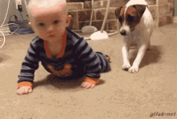
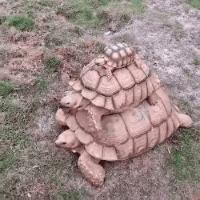
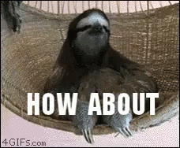

title: Conference Speaking
author:
  name: Emily Stamey
  twitter: elstamey
  url: http://elstamey.com
output: gdirdu-snowandtell/conference-speaking.html
theme: jdan/cleaver-retro
style: my-style.css
controls: true

-- 

# Conference Speaking

(hint: I'm going to talk you into it ;)
--

### Reasons
-  Share What You Are Working On/Learning
-  Learn More

--

### Reasons
-  Share What You Are Working On/Learning
-  Learn More
-  Travel

--

### Brainstorming

- Topics You Know Really Well
- Things You Learned On A Project
- Something Your Non-Tech Friends Don't Understand How Cool It Is!

--

### Finding Conferences

- Familiar
- Comfortable
- Supportive

--

### Finding Conferences

- Familiar
- Comfortable
- Supportive

#### ==> Grow Into It
--

### Submit To Many Conferences

- Abstract
- Paper
- Proposal

--

### Rejection Will Happen

--

### Acceptance Will Happen

--

### You Will React

--

### Prepare For Adventure

--

### Prepare Your Talk

- Outline
- Learning Outcomes
- Build Great Content
- PRACTICE

--