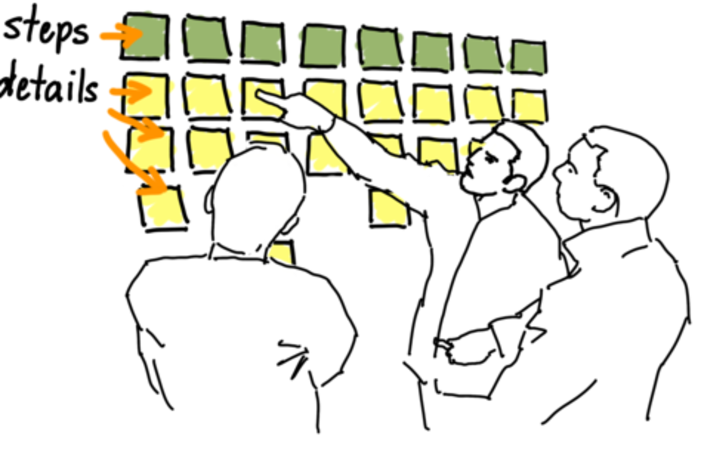

title: Emily Stamey
author:
    name: Emily Stamey
    twitter: elstamey
    url: http://elstamey.com
output: sketch.html
theme: elstamey/reveal-cleaver-theme
style: my-style.css
-------------------

### Emily Stamey
Software Engineer @ InQuest

[Twitter: @elstamey](https://twitter.com/elstamey)

[Blog: elstamey.com](http://www.elstamey.com/)

--

# Quick Poll

- How much do you work with the user-facing parts of the apps you build?
- How much do you work directly with customers and users?
- How many work in agencies?

--

# The Plan

1. Get a big-picture idea of how User Story Mapping works
  - includes a brief solo exercise 
  
  *break*
  
2. Organize into small groups
3. Build a story map based on a social web site
  - will include a **break**

--

# Part one

[link](./skateboard.html#/1)

--

--

## Trust me

- This will be fun

--

## Where did you travel from to get here?

--

## What color shirt are you wearing?

--

## First programming language

--

## Favorite animal

--

## Favorite social web site

--

## Now we can form groups

--

## Goal is to build a new app or add features to one that already exists

- agree on a premise as a team
- agree on the purpose of the app

--
 
## you aren't developers anymore

--

## Describe Features

features can do any of the following:
- add to the app
- change some functionality
- create an entirely different app

--

## Identify Risk, Unknowns, and Asusmptions

--

